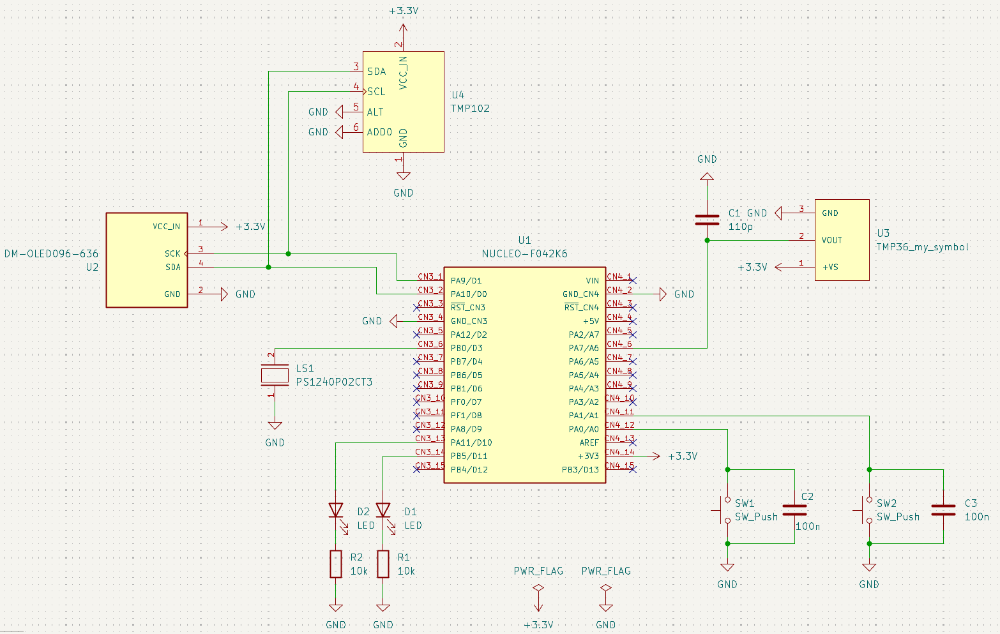

# STM32 Nucleo Temperature Alarm

## Overview
A temperature monitoring system built with an STM32 Nucleo board and a custom PCB.  
The system measures temperature, compares it to a user-set threshold (configured via push buttons), and activates a buzzer if the temperature falls below the threshold.

## Hardware
- STM32 Nucleo F042K6 development board
- Custom PCB designed in KiCad
- Analog temperature sensor TMP36
- "Digital" temperature sensor TMP102
- Push buttons for setting threshold
- Buzzer for alarm output
- OLED display
- Status LEDs
### System overview

  

### Schematic

  

<!--The full schematic and PCB layout are available in the [`hardware/`](./hardware) folder.--!>

## Firmware
- Developed using STM32CubeMX and STM32 HAL drivers
- Implements:
  - Temperature reading
  - Button input handling
  - Threshold comparison
  - Buzzer control

Firmware source is located in the [`firmware/`](./firmware) folder.  
To rebuild: open the `.ioc` file in STM32CubeMX, generate code, then compile in your IDE (e.g., STM32CubeIDE).

## How to Build & Run
1. Flash the firmware to the STM32 Nucleo board.  
2. Connect the PCB with the buzzer, buttons, and sensor.  
3. Power up and test by adjusting the threshold.  

## License
MIT License (or your choice)
