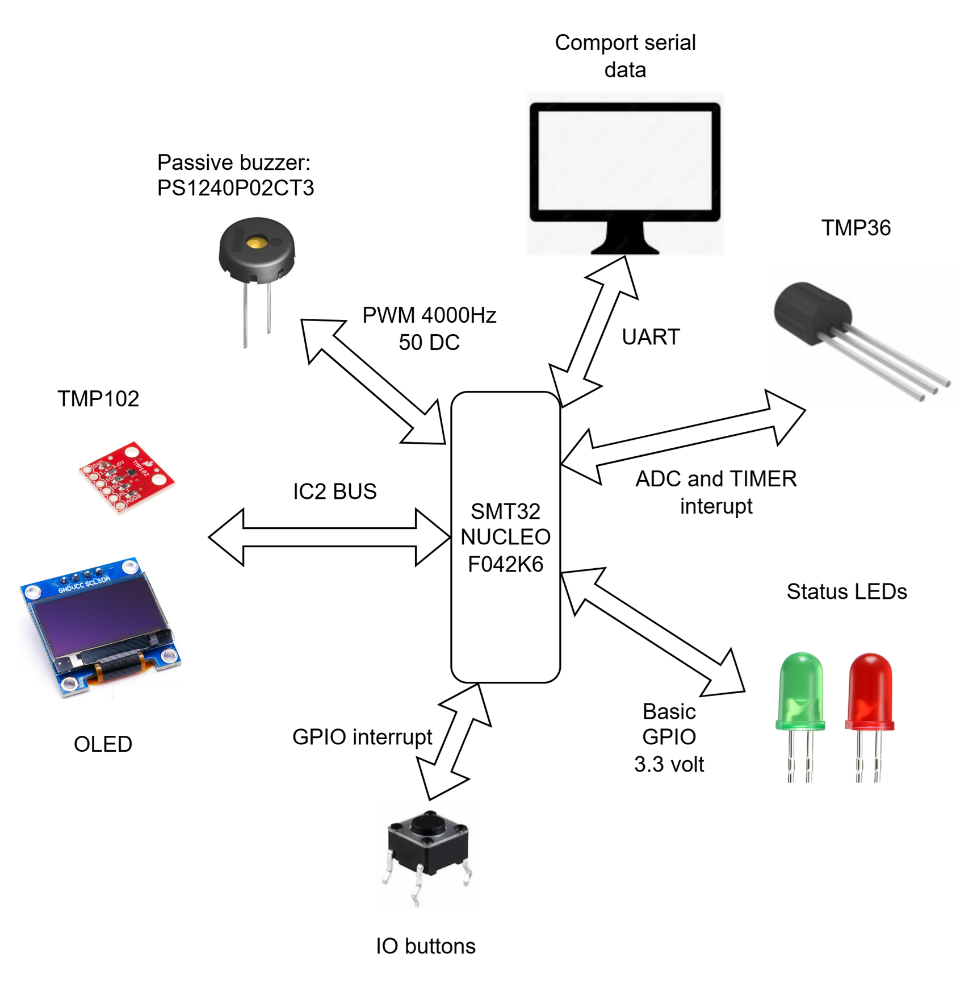

# STM32 Nucleo Temperature Alarm

## Overview
The objective of this project is to gain practical experience with the STM32 Nucleo ecosystem and PCB design using KiCad.  
Additionally, it implements an integrated temperature alarm system that activates when the measured temperature falls below a user-defined threshold.  
A potential application is monitoring room temperature when ventilating by opening windows.

## Hardware
- STM32 Nucleo F042K6 development board
- Custom PCB designed in KiCad
- Analog temperature sensor TMP36
- "Digital" temperature sensor TMP102
- Push buttons for setting threshold
- Buzzer for alarm output
- OLED display
- Status LEDs
### System overview

  

### OLED
This project uses [stm32-ssd1306] as the display library.  
In addition, I implemented three helper functions to streamline the process of printing text to the OLED.  
These functions are defined in `oled_function.c`:

- `void send_strXY(char *str, uint8_t x, uint8_t y, uint8_t size);`
- `char send_charXY(char ch, uint8_t x, uint8_t y);`
- `void clear_oled(void);`

### Schematic
The Schematic in Kicad is shown below

  

### Breadboard prototype

  

## Firmware
- Developed using STM32CubeMX and STM32 HAL drivers
- Implements:
  - Temperature reading
  - Button input handling
  - Threshold comparison
  - Buzzer control

Firmware source is located in the [`firmware/`](./firmware) folder.  
To rebuild: open the `.ioc` file in STM32CubeMX, generate code, then compile in your IDE (e.g., STM32CubeIDE).

## How to Build & Run
1. Flash the firmware to the STM32 Nucleo board.  
2. Connect the PCB with the buzzer, buttons, and sensor.  
3. Power up and test by adjusting the threshold.  

## License
MIT License (or your choice)

[stm32-ssd1306]: https://github.com/afiskon/stm32-ssd1306

