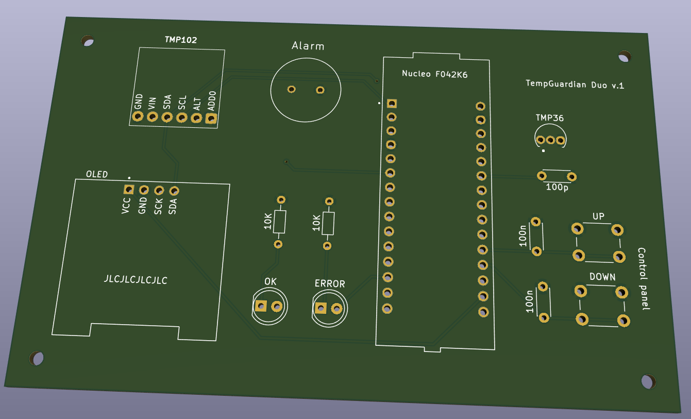

# STM32 Nucleo Temperature Alarm

## Overview
This project demonstrates a temperature alarm system built on the STM32 Nucleo F042K6 platform with a custom PCB designed in KiCad.  
It integrates multiple I/O types, including I²C, ADC with interrupts, PWM, GPIO buttons, and LEDs.  
The system activates an alarm when the measured temperature falls below a user-defined threshold.  
A potential application is monitoring room temperature when ventilating by opening windows.

## Hardware
- STM32 Nucleo F042K6 development board  
- Custom PCB designed in KiCad  
- Analog temperature sensor TMP36  
- Digital temperature sensor TMP102  
- Push buttons for setting the threshold  
- Buzzer for alarm output  
- OLED display  
- Status LEDs  

### System Overview

  

### OLED
This project uses the [stm32-ssd1306] library to drive the OLED display.  
In addition, three helper functions were implemented to simplify text rendering on the OLED.  
These functions are defined in `oled_function.c`:

- `void send_strXY(char *str, uint8_t x, uint8_t y, uint8_t size);`  
- `char send_charXY(char ch, uint8_t x, uint8_t y);`  
- `void clear_oled(void);`  

### Schematic
The schematic designed in KiCad is shown below:  

  

### Breadboard Prototype

  

## Firmware
The firmware was developed using STM32CubeIDE.  
It is available in the [`stm32_firmware/`](./stm32_firmware) folder.  
To rebuild the project:  
1. Open the `.ioc` configuration file in STM32CubeMX.  
2. Regenerate the source code.  
3. Compile using STM32CubeIDE or a compatible ARM toolchain.  

## PCB
### Layout

  

### 3D Model

  

### Assembled PCB
The fully assembled PCB is shown below.  
The green LED indicates that the I²C bus is operational.  
The red LED flashes, and the buzzer sounds, when the temperature measured by the TMP102 falls below the user-defined threshold.

  

## PCB Performance
The analog TMP36 sensor showed a deviation of 0–3 °C above the reference, while the TMP102 measured about 1 °C higher.  
Aside from these temperature discrepancies, the PCB performed as expected.

## Demo Video

## Summary
Overall, the project achieved its primary goal of providing hands-on experience with KiCad, as well as STM32 features including ADC with interrupts, timers, I²C, PWM, GPIO, and OLED display integration.  
This made it a valuable learning and familiarization exercise with the STM32 Nucleo ecosystem.

## License
MIT License (or another license of your choice).

[stm32-ssd1306]: https://github.com/afiskon/stm32-ssd1306
